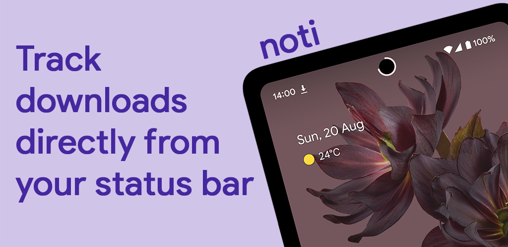

# Noti Progress Bar

> Noti lets you easily track the progress of downloads, music and more directly from your status bar.

## ✨ Features

+ Track downloads, music, and timers from Google Clock.
+ Customizable progress bar or progress circle.
+ Adjustable progress circle to fit your phone's hole punch camera.
+ Automatically hides when in full screen mode.
+ Display Noti in the lockscreen by enabling the accessibility service.
+ Filter which apps you want to track.
+ Customize Noti on a per-app basis.

## ⬇️ Download

## 💜 Help Translate

## 🔑 License

The source code for Noti is available under the GPL-3.0 License. However, distributing the compiled application anywhere, including on Google Play, requires explicit written permission from the original author.